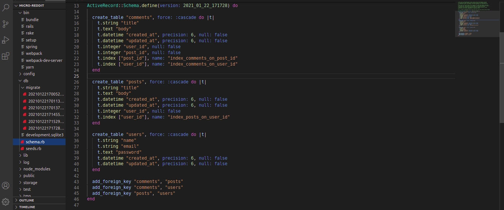

# Micro-reddit

In this project, I will build an application to mimic Reddit data structures necessary to support link submissions and commenting with only back-end. 
This application only support one level of comments.



## Built With

- Ruby 2.7.0
- Ruby on Rails 6.1.1

### Setup

1. To run this project locally, please ensure you have Ruby and Ruby on Rails installed on your machine.
2. Clone this repository by running:

```bash
git clone https://github.com/AhmedAmin90/Micro-reddit-app
```
3. Open your command line and write:

```bash
bin/rails db:migrate
```
4. After that put:

```bash
bin/rails console
```
To initialize the application.

5. To test the application: create users, posts and comments. Do not forget to define the user_id in posts and comments, and post_id in comments.

### Author

👤 **Ahmed Amin*

- Github: [@AhmedAmin90](https://github.com/AhmedAmin90)
- Twitter: [@AhmedAmin12383](https://twitter.com/AhmedAmin12383)
- LinkedIn: [AhmedAmin](https://www.linkedin.com/in/web-developer)

## Show your support

Give a ⭐️ if you like this project!

## Acknowledgments

- Microverse
- The Odin Project

## 📝 License

This project is [MIT](LICENSE) licensed.
